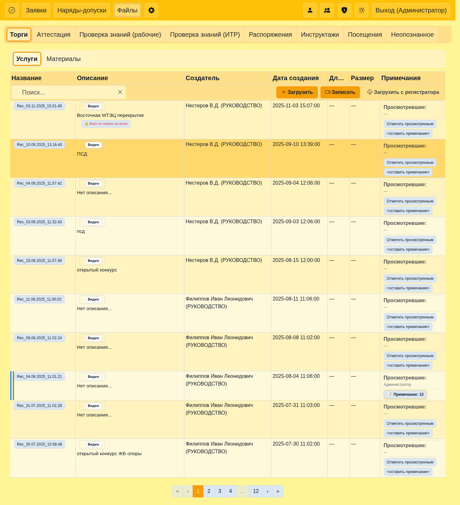
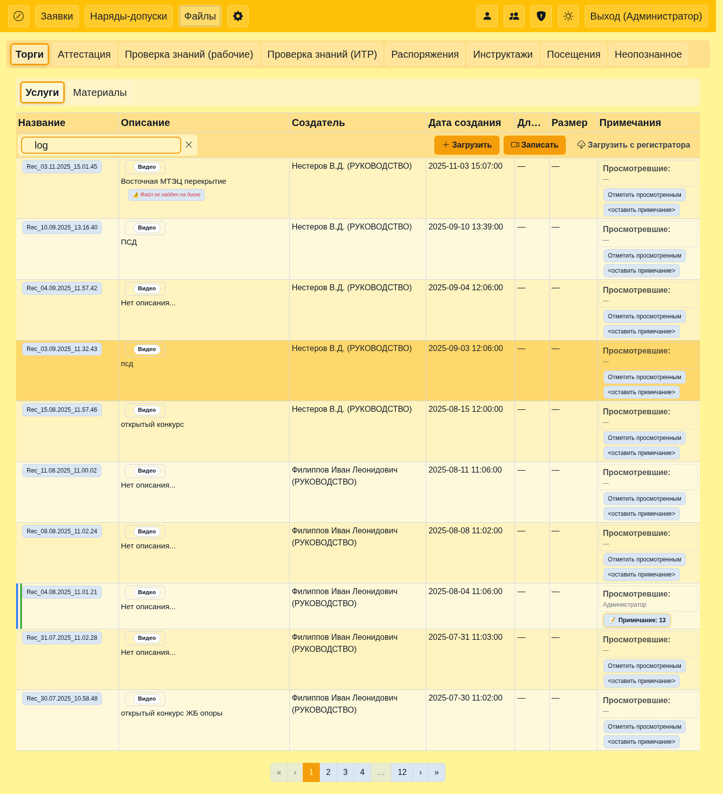
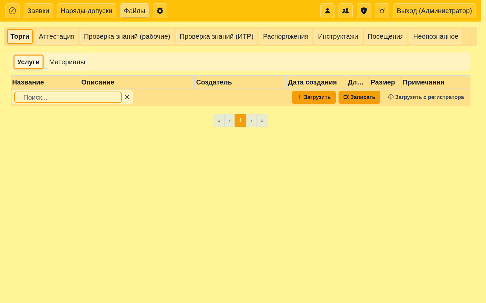

## User Guide

This guide shows how to use search, pagination, files browsing, and orders.

### Contents
- Logging in
- Files: browsing, search, pagination
- Orders: search and clearing search

### Logging in
- Open the application in your browser.
- Enter your credentials.

### Files
- Use the search field to filter files; the URL `q` parameter will update.
- Use pager controls; the URL will include `page` and `page_size`.
- To clear search, click the clear button; the table restores and `q` is removed.

Screenshots:

### Orders
- Enter search text; results update and the `q` parameter appears in the URL.
- Use the clear button to remove `q` and restore the table.

### Images
- See `docs/images/user/` for screenshots.

