## Руководство администратора

В этом руководстве описаны разделы «Пользователи», «Группы», «Категории», «Регистраторы», а также базовые операции в «Файлах» и «Наряды».

### Содержание
- Вход под администратором
- Верхнее меню и переключение темы
- Управление пользователями
- Управление группами
- Категории: два независимых поиска и пагинация
- Регистраторы: два независимых поиска и пагинация
- Кратко про «Файлы» и «Наряды»

### Вход под администратором
- Логин: `admin`
- Пароль: `********`

### Верхнее меню и тема оформления
- В верхней навигации доступны разделы: «Пользователи», «Группы», «Категории», «Регистраторы», «Файлы», «Наряды».
- Переключатель темы (светлая/тёмная и др.) расположен в шапке; переключение моментальное, выбор запоминается.

### Пользователи / Группы
- Доступен поиск (`q`) и постраничная навигация (`page`, `page_size`).
- Контекстные действия доступны по правому клику на строке таблицы.

Примеры пунктов контекстного меню:
- Пользователи: Включить/Отключить, Редактировать, Права, Сброс пароля, Удалить, Добавить нового.
- Группы: Редактировать, Переименовать, Удалить, Права.

Клавиатурные сокращения:
- Enter — подтверждение действия в активном окне.
- Esc — закрытие текущего диалога.
- Двойной клик по строке — ускоренное открытие карточки/редактирования (если доступно на странице).

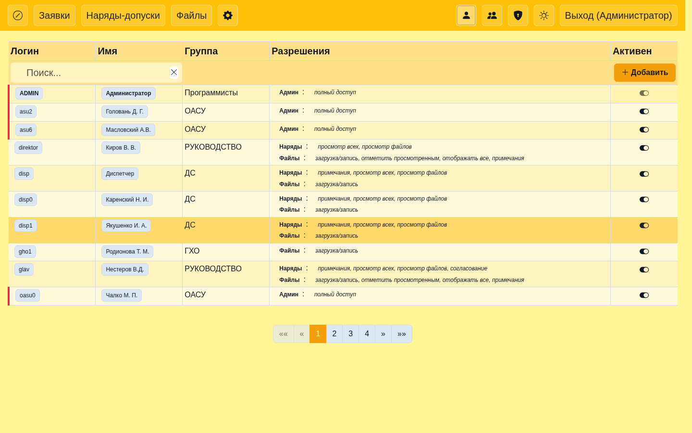

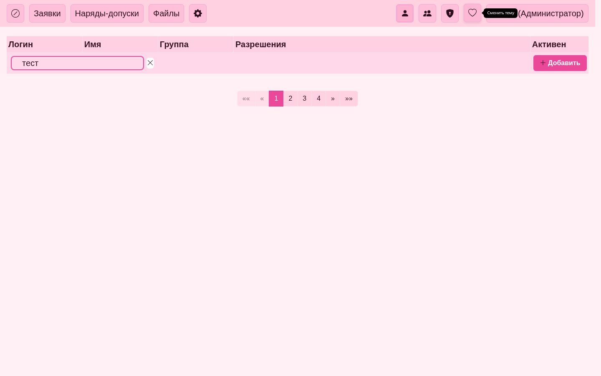

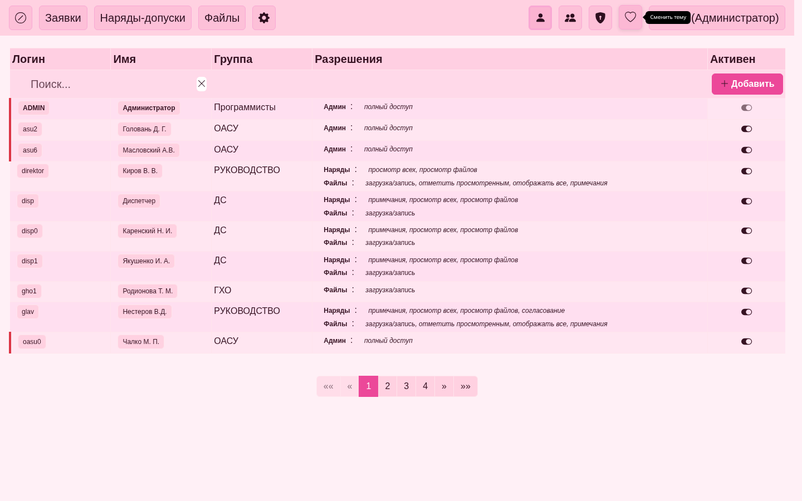

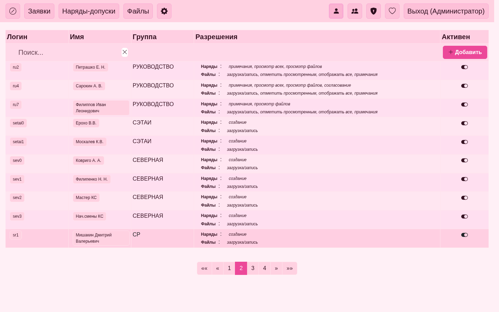

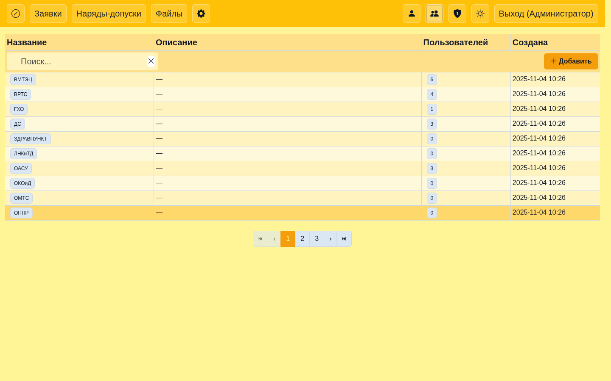

### Категории / Регистраторы
- Два независимых поля поиска: `q_groups` и `q_users`.
- Раздельные параметры пагинации: `page_groups`/`page_size_groups` и `page_users`/`page_size_users`.
- Переходы из верхнего меню включают дефолтные параметры пагинации для предсказуемого поведения.

Полезно знать:
- Поиск и пагинация в таблицах независимы.
- Кнопка очистки рядом с полем поиска убирает только свой `q_*` и сразу обновляет таблицу.
- Правый клик по строке открывает контекстное меню действий (Редактировать, Права, Удалить и т.п.).
- Двойной клик ускоряет переход к редактированию.

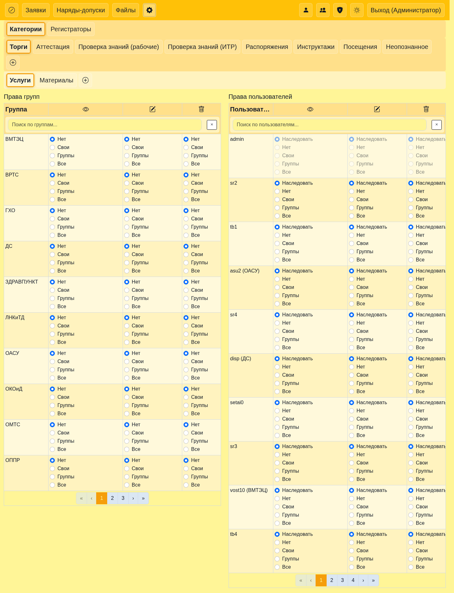

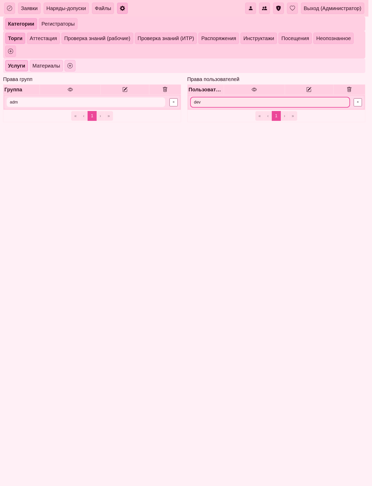

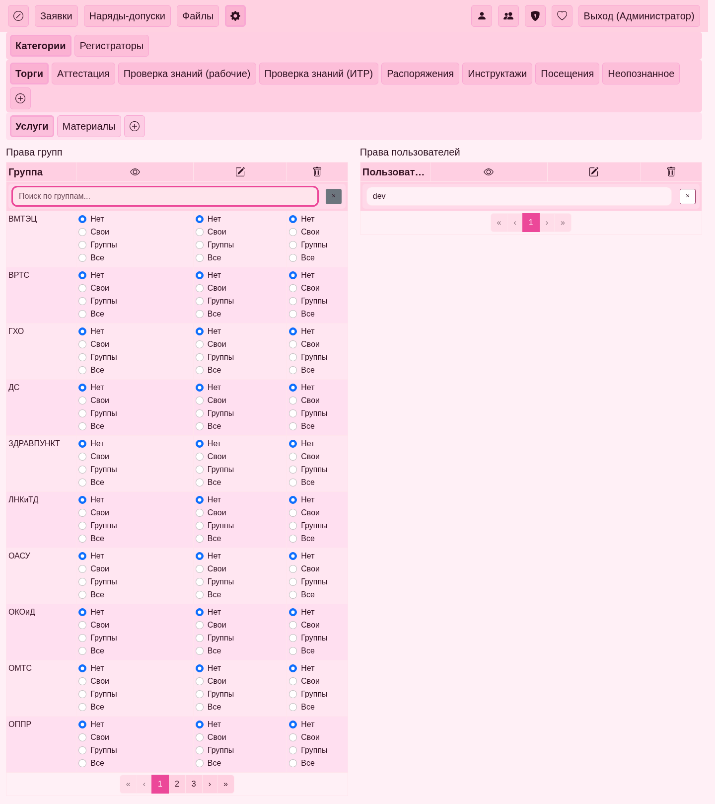

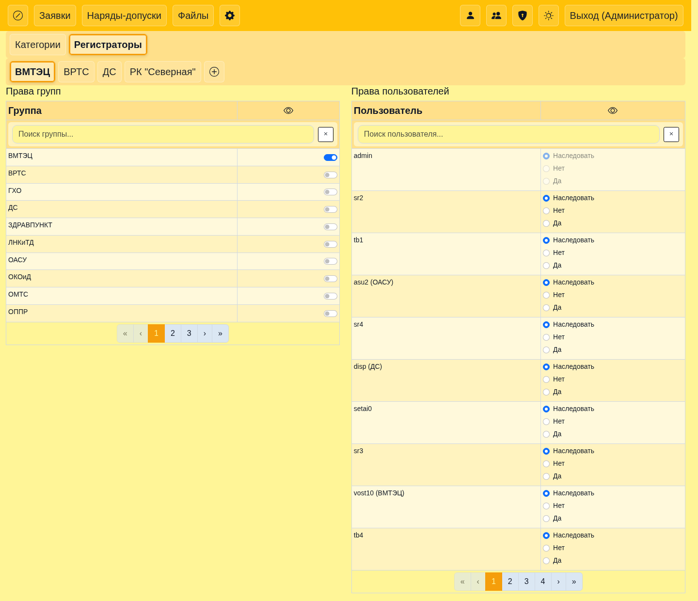

### Файлы / Наряды

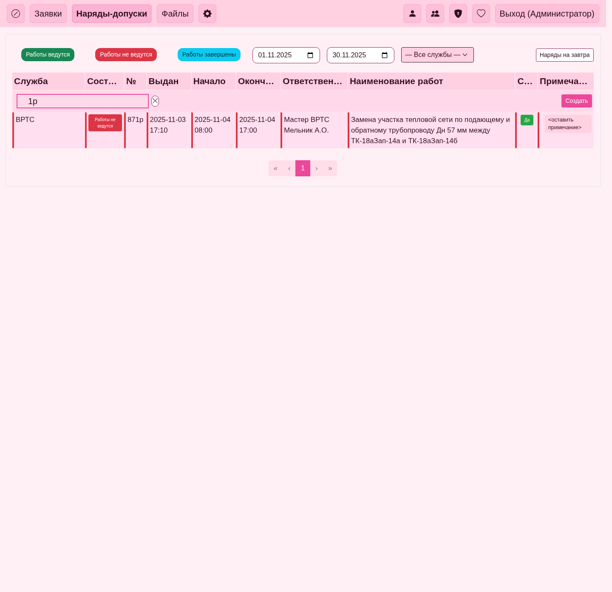

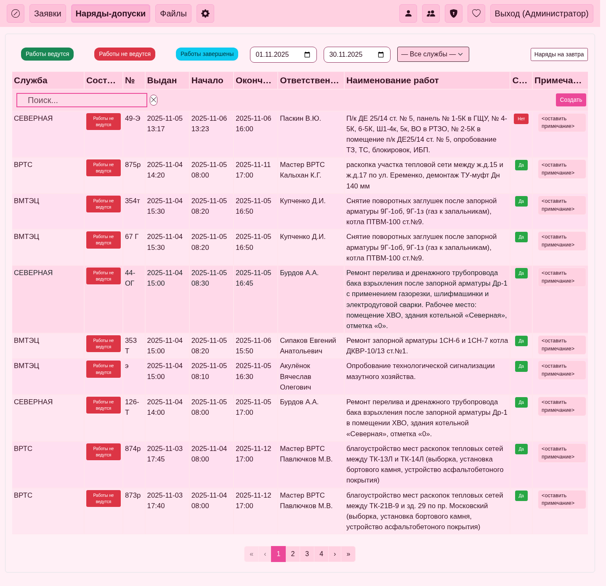

Примечания:
- В «Наряды» при очистке поиска таблица возвращается к обычной пагинации без перезагрузки страницы.
- В «Файлы» поиск и очистка работают аналогично (с сохранением `page`/`page_size` в URL).
- Контекстные меню (если реализованы) закрываются кликом вне области или клавишей Esc.

### Скриншоты
- См. папку `docs/images/admin/`.

