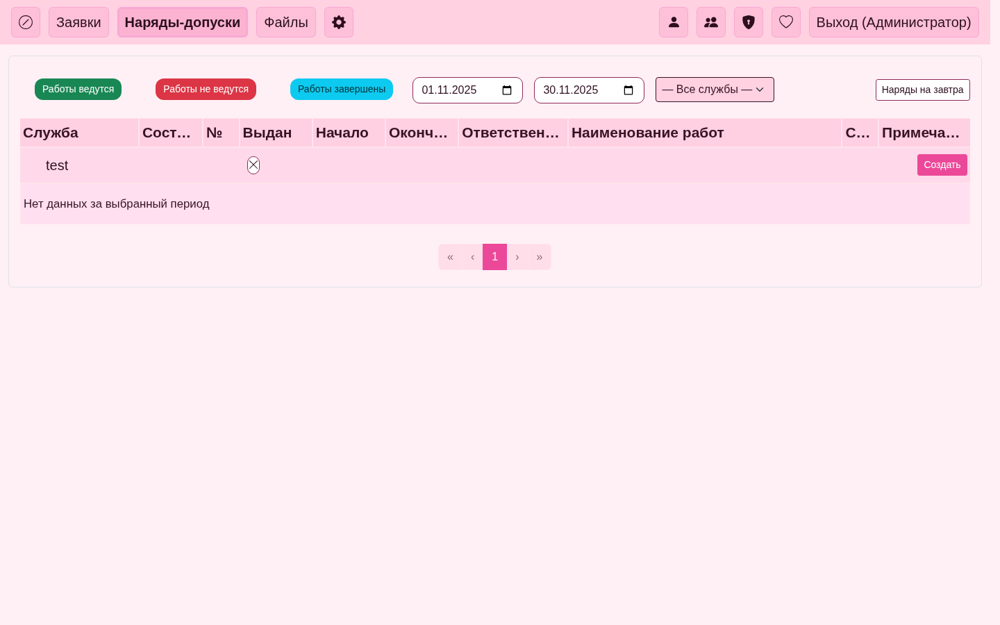

## Руководство разработчика

### Frontend: поиск и пагинация через URL
- Используйте `URLSearchParams` для чтения/записи `q`, `page`, `page_size`.
- Для «Категорий» и «Регистраторов» применяются независимые параметры: `q_groups`, `q_users`, `page_groups`/`page_size_groups`, `page_users`/`page_size_users`.
- Для обновления адресной строки без перезагрузки используйте `history.replaceState`.
- Обработчики очистки должны удалять только свой `q*` и не трогать другие параметры.

### Backend: ожидания от эндпоинтов
- Эндпоинты принимают `q`, `page`, `page_size` (и маппинги для дуальных поисков).
- В «Категориях/Регистраторах» клиентская логика конвертирует `q_groups`/`q_users` в единый `q` на вызове соответствующего API.

### Скрипты
- `scripts/bruteforce_md5.py`: поддержка CPU и Hashcat (GPU). См. `BRUTEFORCE.md`.

### Автоматизация скриншотов
- Headless Chrome через Playwright (внутри `.venv`).
- Скрипт: `scripts/docs_screenshots.py` — логин, навигация, снятие скриншотов.
- Вывод: `docs/images/{user,admin,developer}`.
- Для пересъёма интерактивных сценариев перезапустите скрипт с выставленными переменными окружения для входа.

### Скриншоты
- См. папку `docs/images/developer/`.

Пример (Наряды с параметром `q` в URL):

