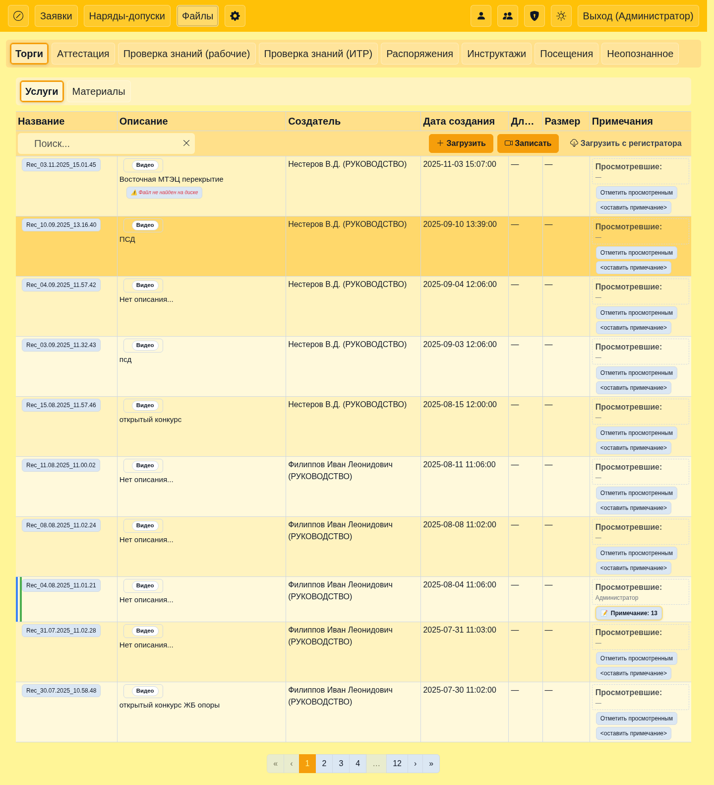
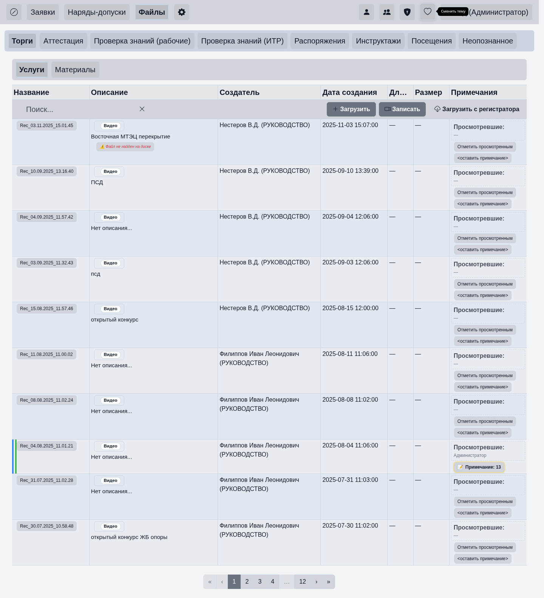
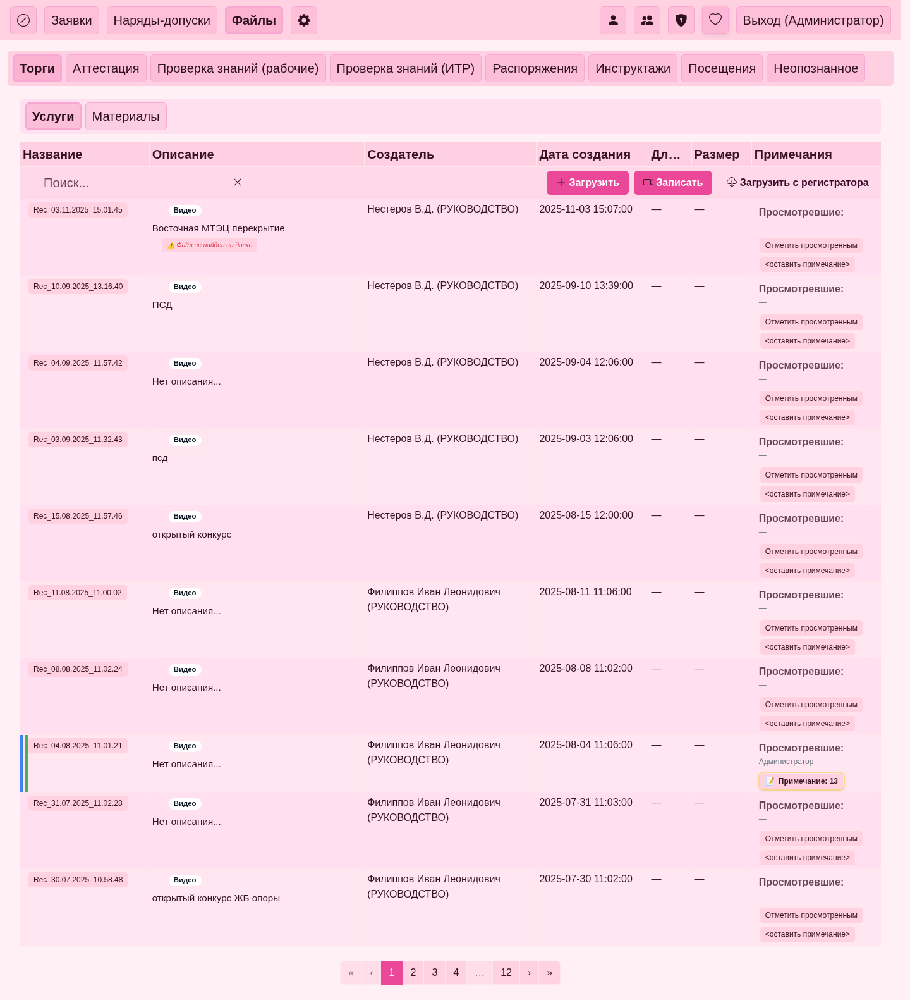
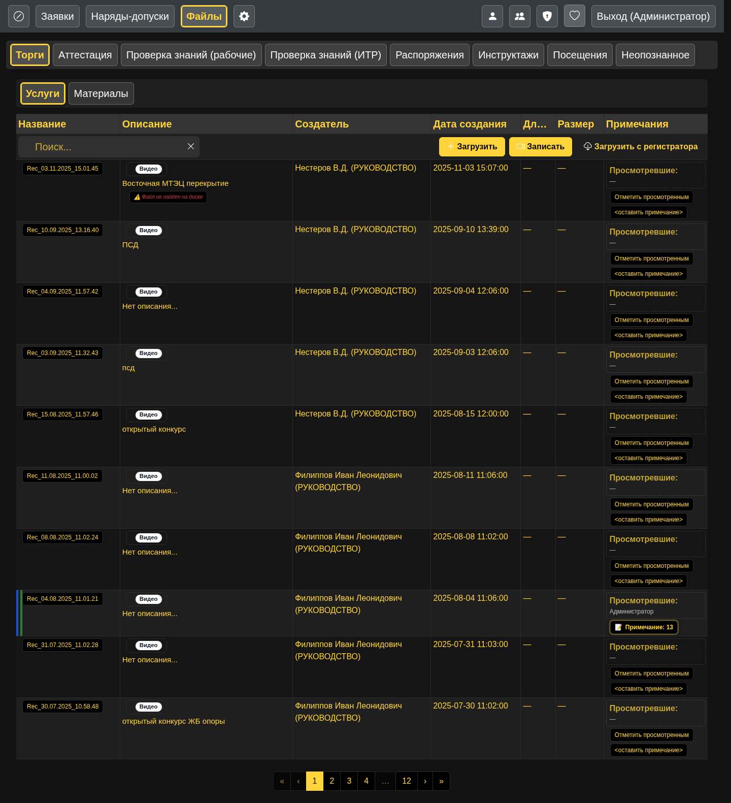
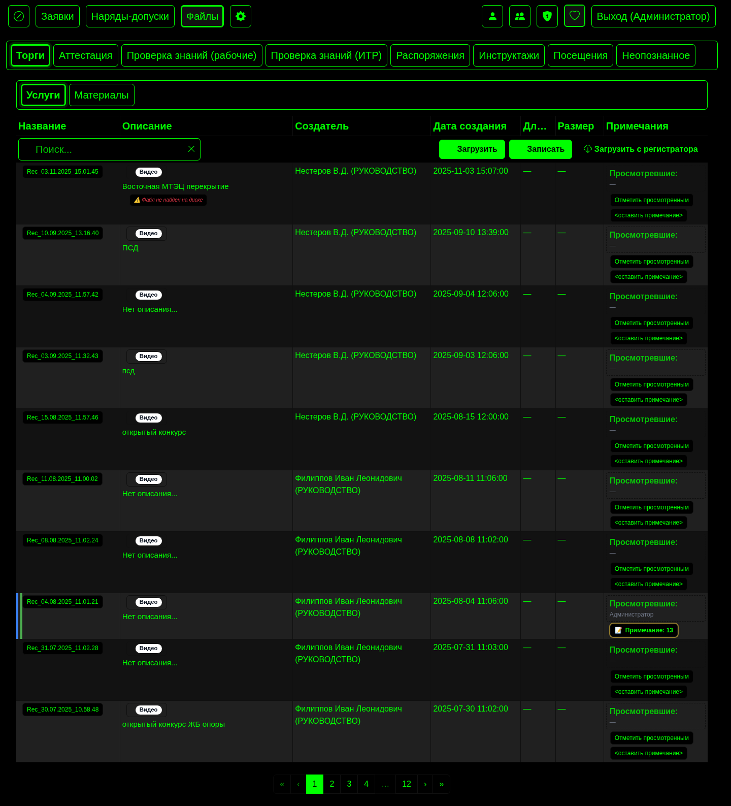
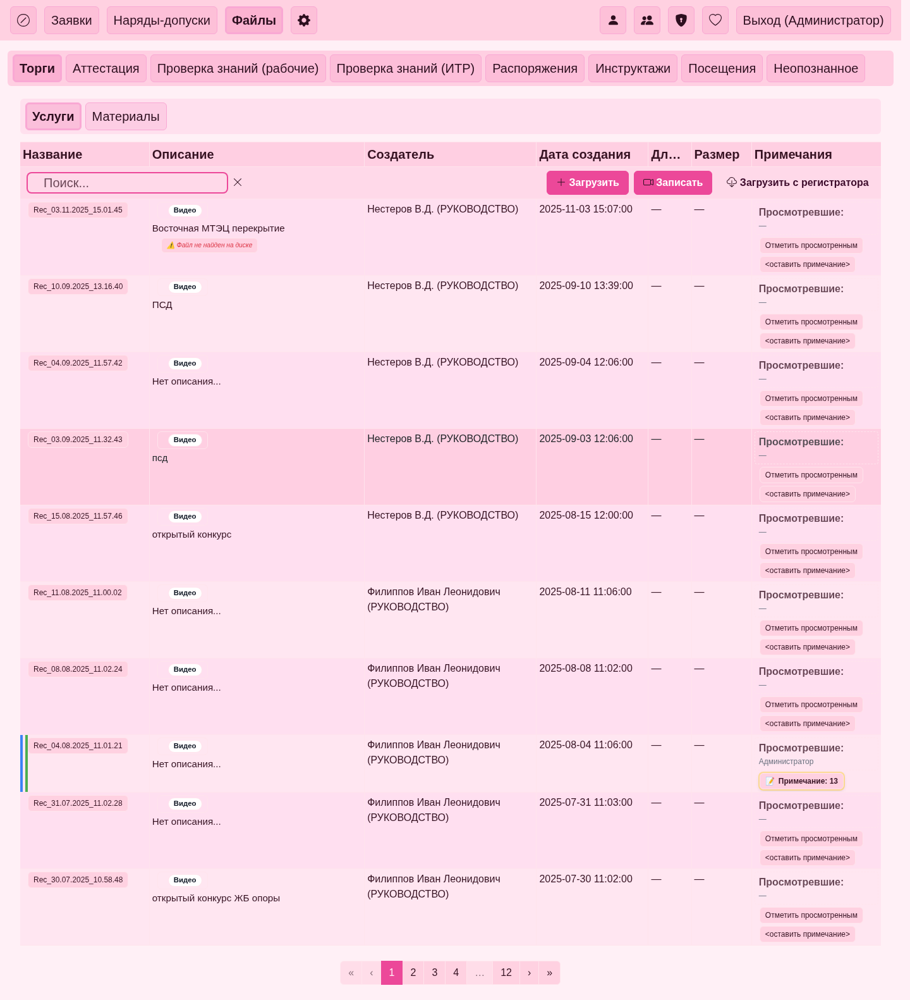

## Руководство пользователя

Краткая инструкция для обычного пользователя: как перемещаться по сайту, искать и открывать файлы, работать со списком нарядов. Без технических деталей.

### Вход
- Откройте сайт и введите ваши логин и пароль.
- После входа вы увидите верхнее меню и страницу по умолчанию (обычно «Файлы» или «Наряды»).

### Главное меню (верхняя панель)
- **Файлы**: переход к каталогу файлов и видео. Доступно всем пользователям.
- **Наряды**: список нарядов с поиском и пагинацией. Доступно всем пользователям.
- Другие пункты (например, Пользователи, Группы, Категории, Регистраторы) относятся к администрированию и обычно скрыты для обычных пользователей.

#### Смена темы
- Переключатель темы (Светлая/Тёмная) находится в верхней панели.
- Нажмите, чтобы моментально сменить оформление. Выбор запоминается для следующих посещений.

  

  

  

  

  

### Файлы: просмотр и действия
- **Поиск**: начните вводить текст в поле поиска — список отфильтруется. 

  

- **Очистка**: кнопка очистки рядом с полем вернёт полный список.

  

- **Пагинация**: используйте элементы управления страницами снизу таблицы (вперёд/назад, номера страниц).

  
- **Открыть**: двойной щелчок по строке файла — откроется просмотрщик (видео/аудио).
- **Скачать**: в просмотрщике или контекстном меню есть пункт «Скачать» (может скрываться, если нет прав).
- **Заметка/Просмотрено**: при наличии прав можно добавить заметку к файлу или пометить как «просмотрено».

#### Контекстное меню
- Откройте правым кликом по строке файла.
- Типичные действия: Открыть, Скачать, Заметка, Пометить просмотренным, Обновить (зависит от прав и состояния файла).
- Закрывается кликом вне меню или клавишей Esc.

  

#### Управление с клавиатуры
- Enter: подтверждение в открытом модальном окне (например, Сохранить заметку).
- Esc: закрыть текущее модальное окно.
- В плеере (открыт просмотр файла):
  - F — полный экран
  - M — выключить/включить звук
  - P или Пробел — пауза/воспроизведение

#### Двойные клики
- Двойной щелчок по строке файла — открыть файл в просмотрщике.

### Наряды: поиск и навигация
- **Поиск**: введите часть номера/текста — список сузится до совпадений.

  

- **Очистка**: нажмите на кнопку очистки рядом с полем, чтобы вернуться к полному списку.

  
- **Пагинация**: переходите на следующую/предыдущую страницу по кнопкам внизу.

#### Контекстное меню и клики
- По умолчанию действия выполняются кнопками на странице; отдельное контекстное меню может отсутствовать.
- Двойной щелчок по строке (если включено) открывает подробности наряда или связанную карточку.

Примечания:
- Если пункт или действие недоступны, вероятно, у вашей учётной записи нет соответствующих прав — обратитесь к администратору.
- Страница может обновляться без перезагрузки благодаря внутренним механизмам — это нормально.

